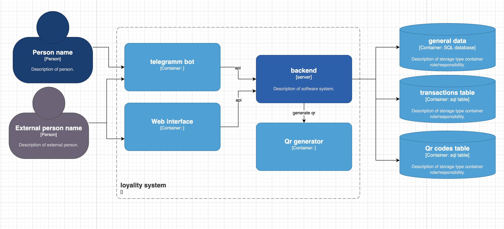

# Система лояльности для детей

## Описание системы

Система лояльности позволяет детям накапливать баллы за выполненные задания или достижения, управляемая через телеграмм-ботов и веб-интерфейс. Система поддерживает функциональность как для участников программы (детей), так и для администраторов.

## Архитектура

1. **Бэкэнд Сервер**
    - Обрабатывает запросы и управление данными
    - Управляет QR-кодами
    - Хранит данные о пользователях, транзакциях и QR-кодах

2. **Телеграмм-боты**
    - **Для участников**: Регистрация, просмотр баллов, добавление баллов через QR-код
    - **Для администраторов**: Просмотр участников, управление баллами, генерация QR-кодов
    - Подробнее в [документации по ботам](server/cmd/telegrambot/README.md)

3. **Веб-интерфейс**
    - Доступен для администраторов
    - Поддерживает сортировку, поиск, редактирование данных
    - Доступен по адресу <http://127.0.0.1:8080/admin/>

4. **Генератор QR-кодов**
    - Генерация QR-кодов для добавления баллов
    - Доступен через административный бот и веб-интерфейс

## База данных

- **Таблица Users**
  - Поля: `id`:uuid(key1), `telegramm`:string(key2), `first_name`:string, `last_name`:string, `middle_name`: string,`points`:int, `registration_time`:timestamp, `group`:uint, `deleted`:bool
  - Описание: Хранение информации об участниках

- **Таблица Transactions**
  - Поля: `id`:uuid(key), `user_id`:uuid, `points_added`, `diff`:int, `transaction_time`: timestamp, `code`:uuid(optional)
  - Описание: История всех транзакций по баллам

- **Таблица QrCodes**
  - Поля: `code`:uuid(key), `per_user`:uint, `total_restriction`:int, `cost`:int, `applied_count`:int, `is_active`:bool, `group`:string, `error_code`:int
  - Описание: Сведения о QR-кодах и их ограничениях. Поле `group` позволяет ограничить использование кода определенной группой пользователей. Поле `error_code` содержит код ошибки при применении кода.

- **Таблица CodeUsage**
  - Поля: `code`: uuid, `user_id`: uuid, `count`: uint
  - Описание: Сведения  об использовании QR-кодов

## API сервера

### Аутентификация API

Все API-запросы (кроме административных) требуют аутентификацию с помощью токена API. Токен должен быть передан в заголовке `Authorization` в формате `Bearer {token}`.

Токен API настраивается в конфигурационном файле `server/cmd/loyalityserver/config.yaml` в секции `api.token`.

Пример:

```
api:
  token: "sirius-rating-system-api-token-2025"
```

Для ботов токен API хранится в файле `server/cmd/telegrambot/api_token.txt`.

### Пользователи (Users)

#### Для участников

- `POST /users/register` - Регистрация нового пользователя
  - Тело запроса: `{ "telegramm": "string", "first_name": "string", "last_name": "string", "group": "string" }`
  - Ответ: `{ "id": "uuid", "telegramm": "string", "first_name": "string", "last_name": "string", "points": 0, "group": "string", "registration_time": "timestamp" }`

- `GET /users/me` - Получение информации о текущем пользователе
  - Заголовок: `Authorization: Bearer {token}`
  - Ответ: `{ "id": "uuid", "telegramm": "string", "first_name": "string", "last_name": "string", "points": "int", "group": "string", "registration_time": "timestamp" }`

#### Для администраторов

- `GET /users` - Получение списка всех пользователей
  - Параметры запроса: `?group=string&sort=field&order=asc|desc&search=string&page=int&limit=int`
  - Ответ: `{ "total": "int", "users": [ ... массив объектов User ... ] }`

- `GET /users/{id}` - Получение информации о конкретном пользователе
  - Ответ: `{ "id": "uuid", "telegramm": "string", "first_name": "string", "last_name": "string", "points": "int", "group": "string", "registration_time": "timestamp" }`

- `PUT /users/{id}` - Обновление информации о пользователе
  - Тело запроса: `{ "first_name": "string", "last_name": "string", "group": "string" }`
  - Ответ: `{ "id": "uuid", "telegramm": "string", "first_name": "string", "last_name": "string", "points": "int", "group": "string", "registration_time": "timestamp" }`

- `DELETE /users/{id}` - Удаление пользователя (мягкое удаление)
  - Ответ: `{ "success": true }`

### QR-коды (Codes)

- `POST /codes` - Создание нового QR-кода (только для администраторов)
  - Тело запроса: `{ "amount": "int", "per_user": "int", "total": "int", "group": "string" }`
  - Ответ: `{ "code": "uuid", "amount": "int", "per_user": "int", "total": "int", "applied_count": 0, "is_active": true, "group": "string", "error_code": 0 }`

- `GET /codes` - Получение списка всех QR-кодов (только для администраторов)
  - Параметры запроса: `?is_active=bool&sort=field&order=asc|desc&page=int&limit=int`
  - Ответ: `{ "total": "int", "codes": [ ... массив объектов Code ... ] }`

- `GET /codes/{code}` - Получение информации о конкретном QR-коде (только для администраторов)
  - Ответ: `{ "code": "uuid", "amount": "int", "per_user": "int", "total": "int", "applied_count": "int", "is_active": "bool", "group": "string", "error_code": "int" }`

- `PUT /codes/{code}` - Обновление информации о QR-коде (только для администраторов)
  - Тело запроса: `{ "amount": "int", "per_user": "int", "total": "int", "is_active": "bool", "group": "string" }`
  - Ответ: `{ "code": "uuid", "amount": "int", "per_user": "int", "total": "int", "applied_count": "int", "is_active": "bool", "group": "string", "error_code": "int" }`

- `DELETE /codes/{code}` - Деактивация QR-кода (только для администраторов)
  - Ответ: `{ "success": true }`

- `POST /codes/{code}/apply` - Применение QR-кода пользователем
  - Заголовок: `Authorization: Bearer {token}`
  - Ответ (успех): `{ "success": true, "points_added": "int", "total_points": "int" }`
  - Ответ (ошибка): `{ "success": false, "error": "string", "error_code": "int" }`
  
  Коды ошибок:
  - `1` - Превышено количество использований кода пользователем
  - `2` - Превышено общее количество использований кода
  - `3` - Пользователь не принадлежит к группе, для которой предназначен код
  - `4` - Код не активен

### Транзакции (Transactions)

- `GET /transactions` - Получение списка всех транзакций (только для администраторов)
  - Параметры запроса: `?user_id=uuid&code=uuid&start_date=timestamp&end_date=timestamp&sort=field&order=asc|desc&page=int&limit=int`
  - Ответ: `{ "total": "int", "transactions": [ ... массив объектов Transaction ... ] }`

- `GET /transactions/me` - Получение списка транзакций текущего пользователя
  - Заголовок: `Authorization: Bearer {token}`
  - Параметры запроса: `?start_date=timestamp&end_date=timestamp&sort=field&order=asc|desc&page=int&limit=int`
  - Ответ: `{ "total": "int", "transactions": [ ... массив объектов Transaction ... ] }`

- `POST /transactions` - Создание новой транзакции (только для администраторов)
  - Тело запроса: `{ "user_id": "uuid", "diff": "int" }`
  - Ответ: `{ "id": "uuid", "user_id": "uuid", "code": null, "diff": "int", "time": "timestamp" }`

### Аутентификация и авторизация

- `POST /auth/telegram` - Аутентификация через Telegram
  - Тело запроса: `{ "telegramm": "string", "auth_data": "string" }`
  - Ответ: `{ "token": "string", "expires_at": "timestamp", "user": { ... объект User ... } }`

- `POST /auth/admin` - Аутентификация администратора
  - Тело запроса: `{ "username": "string", "password": "string" }`
  - Ответ: `{ "token": "string", "expires_at": "timestamp" }`

## Функциональные требования

- Систеа хранит данные об участниках программы
- Доступ через телеграмм бот для участников с опциями:
  - регистрация
  - просмотр своих баллов
  - добавление балла по qr коду
- Доступ через телеграмм бота для админа с опциями:
  - просмотр всех участников программы по наукам
  - Просмотр балло учатсников
  - управление количетсвом баллов участников
  - генерация qr кода на добавление н баллов к раз (с ограничением на количетсво применений и на количетсво применений одним участником)
- Доступ через веб интерфейс для амина в виде таблицы с опциями
  - сортировка по полям
  - поиск по полям
  - редактиврование любых данных
  
## Нефункциональные требования

- Аутентификация
- периодические бекапы
- Сохранение истории всех транзакций и qr кодов


