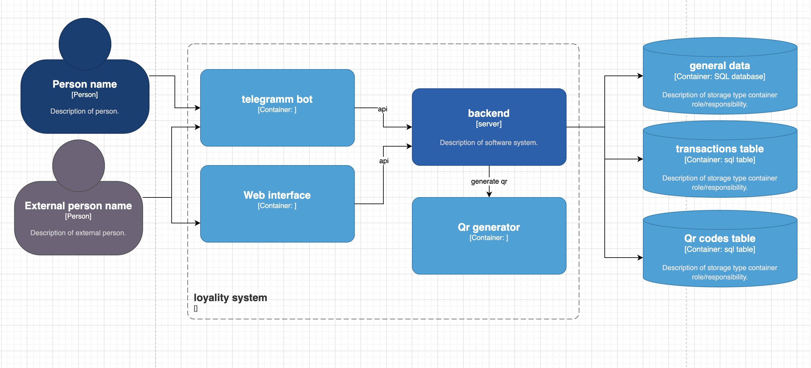

# Система лояльности для детей

## Функциональные требования

- Систеа хранит данные об участниках программы
- Доступ через телеграмм бот для участников с опциями:
  - регистрация
  - просмотр своих баллов
  - добавление балла по qr коду
- Доступ через телеграмм бота для админа с опциями:
  - просмотр всех участников программы по наукам
  - Просмотр балло учатсников
  - управление количетсвом баллоы участников
  - генерация qr кода на добавление н баллов к раз (возможно с ограничением на науку или одному участнику один раз и т.д)
- Доступ через веб интерфейс для амина в виде таблицы с опциями
  - сортировка по полям
  - поиск по полям
  - редактиврование любых данных
  
## Нефункциональные требования

- Аутентификация
- периодические бекапы
- Сохранение истории всех транзакций и qr кодов

